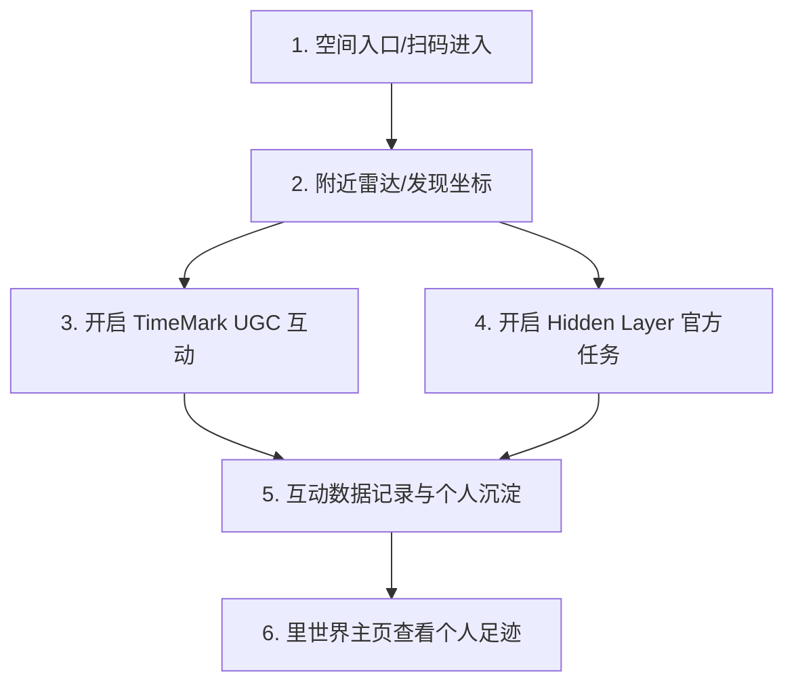

# InnerWorld “里世界” AR 空间设计工作分析与整理

本报告结合西交利物浦大学学生团队的《InnerWorld 里世界》策划案意图，与 **Rokid UXR3.0 SDK 官方设计规范**（包括视觉设计、空间布局、交互设计和声音应用等），对后续开发推进中**需要进行设计的各项工作**进行了系统整理。

---

## 一、 Demo 故事线与闭环流程设计 (Storyline & Flow Design)

为满足比赛和演示需求，需要在单一地点（建议为**西浦校园操场或广场**）设计一条完整、闭环的体验故事线，展示“进入-发现-交互-沉淀”的闭环。

### 1.1 空间入口进入与确认设计 (Spatial Entry & Confirmation)
*   **任务意图**：用户使用 Rokid 硬件对准物理锚点，扫码识别成功后通过主动交互确认开启“里世界”空间图层。
*   **设计内容**：
    *   **物理锚点与识别状态**：设计校园物理标识牌（集成 QR 码与西浦 Logo），并在眼镜端设计识别成功后的视觉锁定框（如 physical anchor 外围环绕绿色发光环）。
    *   **3D 空间确认按钮**：识别成功后在视线前方 0.5m 处弹出一个 3D 浮空按钮（“开启里世界”）。此按钮必须遵循近场手势点击的 Hover、Touch、Press、Release 五种状态，或远场射线瞄准光圈效果。
    *   **剥开空间转场动效**：用户确认点击后，设计一个从物理锚点中心向外扩散的 3D 线框波纹特效，模拟现实世界图层被“撕开/剥离”，逐步显现周围隐藏空间元素的过程。
    *   **手势引导说明**：在空间完全展开后，若当前主交互是手势（非默认 3DoF 射线），需在 FOV 中心弹出一个简短的透明手势引导动画（如“捏合”或“食指点击”演示），并在 3 秒后淡出。

### 1.2 空间雷达与坐标发现 (Radar & Discovery)
*   **任务意图**：用户进入空间后，能通过三维交互雷达和空间物理指向标快速、无感地发现周围的“里世界”隐藏点。
*   **设计内容**：
    *   **分类空间雷达 HUD**：设计低干扰的圆形雷达表盘（作为 3DoF 跟随的常态 HUD 悬浮在视野边缘），使用不同的色彩或微缩 icon 来区分 UGC TimeMark（情感暖色）、学校隐藏层（学校主题色）、城市文旅层（景区青/蓝色）这三种类型的坐标和距离关系。
    *   **6DoF 空间发光物理指向标**：在实际物理地点上设计悬浮的 3D 发光微缩模型或符号（如微缩地标、浮空发光水滴）。当用户通过雷达指引将视线转过去时，该地标亮起，提示用户可以直接使用手势或射线进行点击交互。

### 1.3 TimeMark (UGC 情感层) 体验设计
*   **任务意图**：展示普通用户留下的照片、声音、文字以及 3D 涂鸦/浮空物件等多媒体瞬间，并允许后来者互动。
*   **设计内容**：
    *   **多媒体展示卡片**：设计“鲸鱼云”卡片的视觉样式（包含文字“今天没有鲸鱼，但有晚风”、用户 Kitty 头像、打卡/点赞/评论数）。
    *   **主动触控式空间音频播放器**：
        *   **3D 播放控制 UI**：在语音留言卡片旁设计悬浮的 3D 播放/暂停控制按钮与环形进度条。默认状态下静音，避免多音源混杂。
        *   **主动触碰触发**：用户必须步入近场（0.5m 内）使用食指点击“播放”按钮（或用射线射击），方可启动音频。音频输出挂载 SDK 空间音频（Spatial Audio）组件，根据用户的头部旋转与距离变化，动态调整双耳声相。
    *   **3D 预设资产库与自由涂鸦设计**：
        *   **3D 校园特色预设库**：设计一套官方 3D 浮空资产库，包含表情贴纸、3D 校徽徽章、毕业帽、缩微标志性建筑等，并设计分类浏览与一键选择放置的 UI 界面。
        *   **自由 3D 画笔与渲染限制**：设计 3D 涂鸦的画笔效果（如发光霓虹、多彩色带等），并设计自由手绘线条的顶点简化逻辑，确保单个手绘涂鸦的同屏面数低于 1 万面以保证性能。

    *   **坐标聚合与排布规则**：设计当多个用户在同一区域留言时，卡片在 Z 轴上的排布堆叠逻辑，以及避免 AR 视野拥挤的“最小间距与坐标聚合”视觉算法。
    *   **动态生命周期与治理规则**：
        *   **Demo 阶段免审即时可见**：在 Demo 测试/演示期间，手势手绘涂鸦和语音留言无需后台审核，一经发布即时在空间 6DoF 坐标点显示。
        *   **48小时动态存续规则**：设计卡片与涂鸦的默认存续时间为 48 小时。被点赞或打卡较多的内容自动延长存续期。同时，卡片 UI 设计一键“举报并隐藏”的手势，方便用户主动隐藏垃圾内容。
    *   **AR 空间键盘设计**：为近场点击设计半球形弧度布局键盘（摆放在 0.45m 舒适交互区），单键大小需满足手势点击防误触，并支持离线拼音/英文输入。
    *   **三维空间绘画工具面板**：设计 3D 涂鸦的控制界面（画笔粗细、颜色色盘、撤销与清空按钮），并设计“捏合移动划线（Pinch-and-Drag）”的手势涂鸦交互状态。
    *   **录音状态 HUD 指示器**：设计录音中的声波动态反馈（Visualizer）、当前录音时长进度、以及暂停/重录/确认发送的多模态反馈面板。

### 1.4 Hidden Layer (官方/商业任务层) 任务设计
*   **任务意图**：学校官方或品牌方发布活动、导览或联名任务，用户通过打卡或解谜获得徽章。
*   **设计内容**：
    *   **任务 NPC/官方虚拟引导**：设计引导用户完成任务的虚拟角色（如西浦吉祥物或校史馆引导人）。
    *   **任务提示与完成反馈**：设计任务进行中的指示窗口（Gaze-Following 面板），以及任务完成后“徽章领取”的奖励动效。

### 1.5 个人足迹沉淀 (Account & Archiving)
*   **任务意图**：用户查看自己发布、点赞过的卡片以及收集到的徽章。
*   **设计内容**：
    *   **“我的里世界”面板**：设计“我的发布”、“我的点赞”、“徽章记录”三个标签页的 UI 布局。

---

## 二、 AR 空间布局与视觉体验设计 (Spatial & Visual Design)

根据 Rokid SDK 规范，AR 近眼显示属于虚拟与现实的叠加，设计时必须遵守特有的光学与生理学约束。

### 2.1 颜色与亮度系统设计 (Color & Brightness)
*   **黑色留白规范**：在 AR 近眼显示中**“黑色即透明”**。所有 UI 面板和 3D 模型设计中，必须利用黑色做留白，避免设计出带有大面积黑色块的虚拟物。
*   **白色防眩光规范**：**“白色即强光”**。UI 容器和背景板设计应彻底避免大面积纯白色，改用中性色、渐变色或半透明玻璃材质（Glassmorphism），防止用户感到刺眼或出现双眼不能聚焦。
*   **近距亮度自适应**：当交互内容放置在人眼近处（0.5m以内）时，需要设计可调节的内容亮度，使之与现场真实环境光亮度协调，降低辐辏调节冲突。

### 2.2 空间 Z 轴布局与信息层级 (Z-Axis Layout)
*   **近场手势交互区**：需要手动触碰点击的 UI（如打卡按钮、点赞按钮），必须设计摆放在距离眼睛 **0.4m ~ 0.5m** 的半球形区域内，这符合人体工学的舒适触及范围。
*   **远场/射线交互区**：仅供观看或使用射线/远场手势操作的内容（如大面积卡片、雷达大面板），建议设计摆放在 **1m 以外**（最好在 1m ~ 5m 范围内）。
*   **层级收起与避让逻辑**：新打开的弹窗/Toast 必须先出现在用户的 **FOV 中心（视线目标）**，且窗口必须永远朝向用户（Billboard 广告牌效果）。同时，设计前层遮挡后层时的“平滑收缩/淡出避让”动画。

### 2.3 字体、图标与热区大小 (Typography & Hotspots)
*   **字号与间距大小**：二维文字在三维空间中会随距离缩放。根据 Rokid 最小纵向夹角 0.33° 的要求：
    *   在常规阅读距离（例如 1.2m），补充说明文字字号应不小于 **20px**，主标题不小于 **32px**。
    *   文字应使用高清晰度的 TextMeshPro，并设计为**永远朝向用户**（Billboard 模式）。
*   **交互热区规范**：
    *   远场手势/射线点击的图标，设计热区尺寸必须达到人眼夹角 **2.7° × 2.5°** 以上（即在 1m 距离下，按钮的物理大小不得小于约 **4.7cm × 4.3cm**，在 SDK Canvas 中相当于 130 × 120 px），以防用户难以瞄准。

### 2.4 美术视觉风格与调性 (Art Direction)
*   **美术风格**：极简主义轻工业风（贴近 YodaOS 原生系统 UI 风格）。
*   **设计内容**：
    *   **半透明微灰/白色圆角面板**：UI 容器和背景板使用轻量的半透明微灰或微白色磨砂质感，搭配大圆角矩形，在不同光照的真实环境中均能维持文字可读性，同时减少视觉压迫感。
    *   **扁平化单色图标与简约排版**：全面采用扁平化、高对比度的单色矢量图标（如黑白、灰白、系统主题色），极简化非必要装饰，确保用户能将注意力集中在空间信息本身。

---

## 三、 3D 美术资产设计 (3D Asset Design)

策划案中的美术仅为示意，实际 3D 资产设计需要符合 Rokid 硬件运行性能与 AR 特性。

### 3.1 3D 模型限制与规范
*   **性能面数控制**：为了在眼镜端保证 60+ 帧率的流畅体验，同屏渲染的所有 3D 模型（包括空间地标、任务 NPC、鲸鱼云等）**总面数必须控制在 30万面 (300k Polygons) 以内**。
*   **避免全黑模型**：3D 模型（如 NPC 皮肤或衣服、道具表面）不得使用全黑色贴图，否则该部分在眼镜中会完全穿透露出背景。
*   **小场景与天空盒设计**：为了实现强虚实结合，**严禁使用完全遮挡真实世界的常规 Skybox**。应设计开放式的“小岛型”或“局部浮动型”小场景。如确需大场景，必须在显示 FOV 边缘设计向黑色过渡的渐变效果，实现视线无感消隐。

---

## 四、 交互与多模态反馈设计 (Interaction & Feedback)

由于 AR 缺乏物理触觉反馈，必须通过极高灵敏度的**视觉与听觉反馈**来帮助用户确认操作。

### 4.1 手势交互视觉反馈 (Gesture UI States)
若采用手势交互，近场食指点击需要设计完整的**五个交互状态视觉动效**：
1.  **默认状态**：未接触状态。
2.  **Hover 状态**：手指靠近 UI（进入触发边界，通常为 0.04m）时，按钮视觉上**向上抬起/高亮**。同时，食指指尖应设计一盏**“食指小灯”**（光效随距离远近强弱变化），以提示只有食指能产生交互。
3.  **触碰状态**：手指刚接触到按钮，按钮颜色/亮度发生变化。
4.  **按压状态**：手指压下至底部（进入 -0.02m），按钮产生强烈的下压视觉变化，并伴随“按下”音效。
5.  **抬起（响应）状态**：手指抬起离开按钮瞬间，触发实际的事件响应，按钮恢复默认，播放“点击完成”的清脆音效。

### 4.2 空间音频与反馈音效 (Spatial Audio & Sound Effects)
*   **三维空间音效**：对于“鲸鱼云 TimeMark”或“任务角色”，应将其声音绑定在空间中的对应 3D 节点上（使用 SDK 空间音频组件），让用户随着转头或走近，能听出声音的距离与方位。
*   **配对交互音效**：为点击、滑动交互设计“Down 键按下”与“Up 键抬起”的一对**配对音效**，增强点击的操作确认感。

---

## 五、 后台与管理系统原型设计 (Backend & Management Design)

为支持“里世界”的长期运营与演示，还需要对管理后台和配置端进行流程与原型设计。

### 5.1 机构空间管理后台 (Institution Dashboard)
*   **Hidden Layer 创建流**：设计学校或企业用户“自助配置地点、编辑内容、设置任务规则、发放徽章权限”的后台操作流程原型。
*   **空间内容编辑器 (Spatial Editor)**：设计一个易用的编辑器原型，允许运营者上传图片、文字、录入语音、导入 3D 徽章或 NPC 模型，并关联物理 QR 码/GPS 地理坐标。
*   **数据看板 (Data Dashboard)**：设计统计“曝光量、打开率、完成率、点赞数、打卡热力图”的可视化界面，帮助机构评估空间运营效果。
*   **AI 内容辅助工具**：设计利用大语言模型辅助生成“空间路线导览词、任务提示说明、活动文案”的 AI 工具界面。

---

> [!IMPORTANT]
> **后续推进建议：**
> 1. **第一阶段（Demo 闭环）**：我们将重点放在**“西浦校园操场/广场 Demo”**的设计。
> 2. **优先明确交互方式**：需要确定我们是使用 Rokid 默认的 **3DoF 主机射线交互**（开发成本低，用户学习快），还是使用 **手势追踪交互**（沉浸感更强，但需要设计引导动画、食指小灯以及 5 态视觉/音效反馈）。
