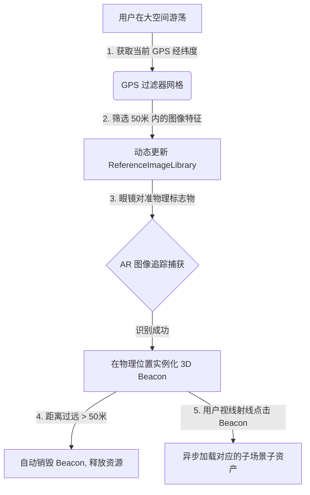

# Large Space AR Navigation & Scene Management Framework
## —— 基于 GPS 粗定位过滤与空间 Beacon 触发的轻量级场景管理方案

针对“大场景空间游荡、场景分段加载与动态资源控制”的需求，本方案进行了技术可行性评估，并设计了一套**基于“GPS 地理网格 ➔ 图像锁定 ➔ 空间 Beacon ➔ 动态加载/销毁”**的完整架构设计。

---

## 一、 可行性评估 (Feasibility Analysis)

在 AR 眼镜端实现大空间导览面临的主要瓶颈在于**内存（RAM）开销**和**图像识别特征库的检索算力开销**。如果在单一场景中加载所有的 3D 资产，或者让 AR 追踪引擎同屏检索数百张标识图，会导致眼镜严重发热、卡顿并降低 SLAM 稳定性。

本设计方案在技术上是**完全可行的**，核心可行性依据如下：

1.  **GPS 粗过滤降低算力开销**：Android 端（Rokid Station）支持标准 Location Services（GPS/网格基站定位）。通过在 Unity 中设定当前的经纬度网格（如半径 50 米），动态加载/卸载 `ARTrackedImageManager` 的特征图库（`ReferenceImageLibrary`），能将同屏检索的图像目标降到个位数，大幅降低计算机视觉（CV）功耗。
2.  **空间 Beacon 做过渡占位**：当用户进入区域但还未进入深度交互时，不加载笨重的 3D 精细场景，仅在被扫到的坐标处实例化一个低多边形（如 $<1000$ 面）的 **Spatial Beacon（空间信标）**。只有当用户使用射线点击 Beacon 确认进入时，才触发对应场景的异步加载，这符合工业级 AR 资源调配原则。
3.  **Unity 异步场景加载（Async Loading）与垃圾回收（GC）**：利用 `SceneManager.LoadSceneAsync(sceneName, LoadSceneMode.Additive)` 在后台增量加载场景，并通过 `Resources.UnloadUnusedAssets` 或 **Addressables 资源管理系统** 动态释放内存，能确保用户在游荡时帧率保持在 60fps 以上。

---

## 二、 架构设计与数据流 (System Architecture)



### 1. GPS 过滤器与动态库更新 (GPS Gating)
在 Unity 中启动 `Input.location` 监听，以 $5$ 到 $10$ 秒为周期进行低频采样（低频采样可省电）。
*   **本地配置文件** 存储了每个子场景的信息：
    ```json
    {
      "scene_id": "campus_memory_wall",
      "gps_latitude": 31.27584,
      "gps_longitude": 120.73812,
      "active_radius_meters": 50,
      "marker_image_index": 1,
      "scene_unity_name": "InnerWorldScanAnchorDemo"
    }
    ```
*   当眼镜 GPS 位置与某个 Scene 配置项的距离小于 `active_radius_meters` 时，系统将该场景对应的识别图（如 A1）加入当前的活动识别列表中。

### 2. 空间 Beacon 生命周期 (Beacon Lifetime Management)
*   **生成 (Spawn)**：当眼镜扫描到物理标志物时，并不立刻加载庞大的“里世界墙体”，而是在识别到的 Pose 上生成一个非常好看的、发光旋转的 3D 浮空光球（即 **Spatial Beacon**）。
*   **维持与销毁 (Keep & Destroy)**：
    *   即使图像丢失（眼镜转头看向别处），Beacon 也会利用 Rokid 系统的 SLAM 环境锁定在三维空间中。
    *   系统会持续计算眼镜与 Beacon 的物理距离：
        *   `Distance < 15m`：保持 Beacon 在空间中显示。
        *   `Distance >= 20m`（或位置远离 GPS 范围）：调用 `Destroy(beaconInstance)` 释放它，并将场景资产从内存中完全卸载。

### 3. 动态场景加载与跳转 (Dynamic Scene Loading)
*   当用户使用 3DoF 射线指向这个 Beacon 并且点击确认时，执行异步场景叠加加载：
    ```csharp
    StartCoroutine(LoadSubSceneAsync("InnerWorldScanAnchorDemo"));
    ```
*   异步加载完成后，将新加载场景的 Root 对象节点自动挂载到 Beacon 所在的位置，实现无感平滑展开空间内容。

---

## 三、 真机落地推荐技术路径 (Implementation Steps)

如果您决定在下一个阶段推进本方案，推荐采用以下技术路径进行开发：

1.  **引入 Unity Addressables (可寻址资源系统)**：
    *   将每个小空间的 3D 资源（如记忆墙、Whale Cloud、Mascot）打包成独立的 Addressables AssetBundle。
    *   通过 `Addressables.LoadAssetAsync` 和 `Addressables.Release` 彻底控制内存垃圾回收，避免频繁加载场景引起的掉帧卡顿。
2.  **Android Location API 桥接**：
    *   Unity 原生的 `Input.location` 在室内定位效果一般。建议直接通过 Rokid SDK 中桥接的 Android 原生 `LocationManager`，利用 WiFi/基站混合定位获取更高精度的室内粗定位。
3.  **多图像数据库动态切换 (Multi-DB Swap)**：
    *   对于大空间，预先利用 Rokid 工具编译出多个小型的 `RKImage.db` 库。
    *   根据 GPS 结果，动态调用 `ARTrackedImageManager.SetMarkerDBPath(newDbPath)` 实时切换眼镜当前检索的物理卡片图库，将同屏 CV 图像识别匹配数量降到最低。
